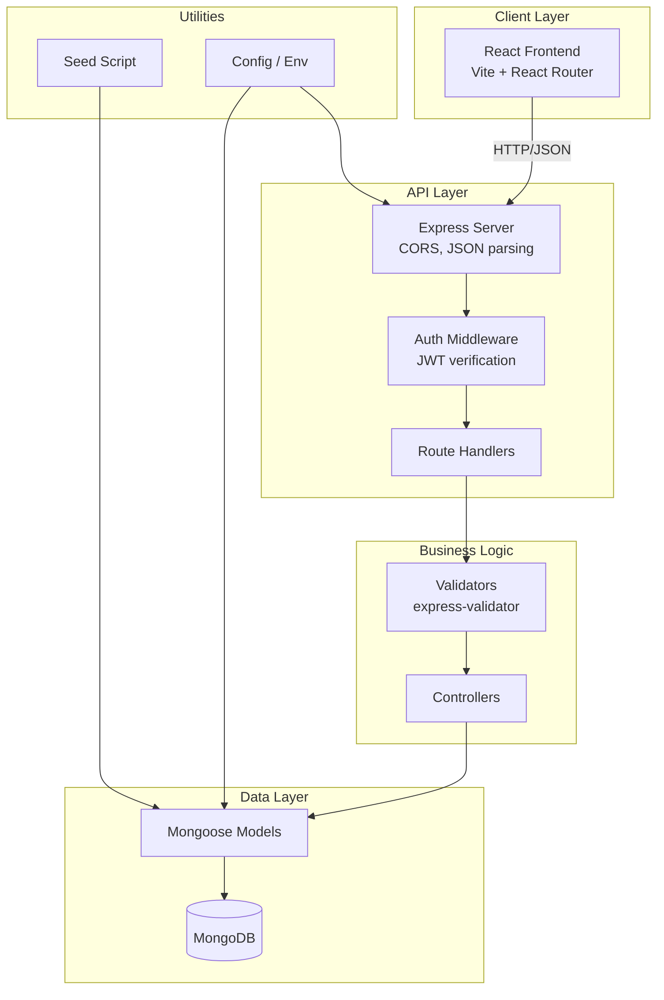
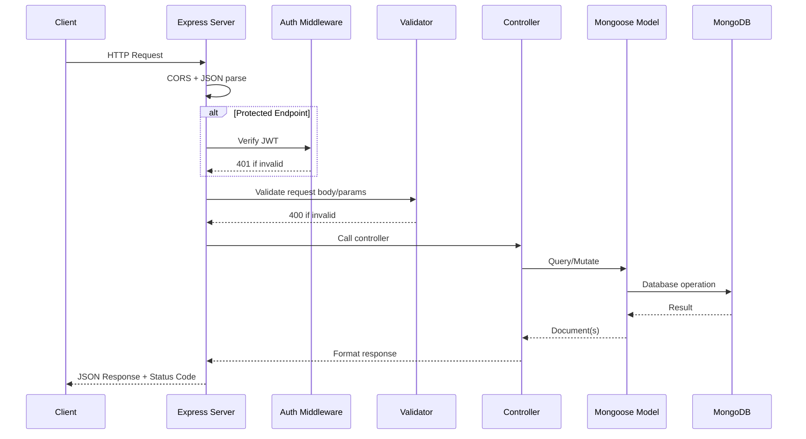

# Design Document: Poultry Farm Backend

## Overview

This document describes the technical design for the FreshFlock Farms backend API server. The backend replaces hardcoded frontend data with a persistent, authenticated RESTful API built on Node.js/Express with MongoDB as the data store and JWT-based authentication.

The server provides public endpoints for website content (company info, testimonials, blog posts, contact form) and protected endpoints for farm operations management (dashboard KPIs, production data, orders). A seed script populates the database with initial data matching the current frontend hardcoded values.

### Key Design Decisions

| Decision | Choice | Rationale |
|----------|--------|-----------|
| Runtime | Node.js + Express | Matches frontend ecosystem (React/Vite), team familiarity |
| Database | MongoDB + Mongoose | Flexible schema suits varied data shapes (KPIs, blog posts, orders); good fit for document-oriented farm records |
| Auth | JWT with bcrypt | Stateless auth simplifies scaling; bcrypt is industry standard for password hashing |
| Validation | express-validator | Declarative validation middleware, integrates cleanly with Express |
| Testing | Jest + Supertest | Standard Node.js test stack; Supertest for HTTP integration tests |
| PBT Library | fast-check | Mature property-based testing library for JavaScript/TypeScript |

## Architecture



### Request Flow



## Components and Interfaces

### Project Structure

```
backend/
├── src/
│   ├── server.js              # Entry point, Express app setup
│   ├── config/
│   │   └── db.js              # MongoDB connection
│   ├── middleware/
│   │   ├── auth.js            # JWT verification middleware
│   │   ├── validate.js        # Validation error handler
│   │   └── errorHandler.js    # Global error handler
│   ├── models/
│   │   ├── User.js
│   │   ├── ProductionRecord.js
│   │   ├── EggProduction.js
│   │   ├── BroilerGrowth.js
│   │   ├── FeedConsumption.js
│   │   ├── Mortality.js
│   │   ├── BlogPost.js
│   │   ├── Contact.js
│   │   ├── CompanyInfo.js
│   │   ├── Testimonial.js
│   │   └── Order.js
│   ├── routes/
│   │   ├── auth.js
│   │   ├── dashboard.js
│   │   ├── eggProduction.js
│   │   ├── broilerGrowth.js
│   │   ├── feed.js
│   │   ├── mortality.js
│   │   ├── blog.js
│   │   ├── contact.js
│   │   ├── company.js
│   │   └── orders.js
│   ├── controllers/
│   │   ├── authController.js
│   │   ├── dashboardController.js
│   │   ├── eggProductionController.js
│   │   ├── broilerGrowthController.js
│   │   ├── feedController.js
│   │   ├── mortalityController.js
│   │   ├── blogController.js
│   │   ├── contactController.js
│   │   ├── companyController.js
│   │   └── ordersController.js
│   └── utils/
│       ├── trendCalculation.js  # Pure function for trend %
│       └── validators.js        # Shared validation schemas
├── seeds/
│   └── seed.js                # Database seeding script
├── tests/
│   ├── unit/
│   │   ├── trendCalculation.test.js
│   │   ├── validators.test.js
│   │   └── auth.test.js
│   ├── property/
│   │   ├── validation.property.test.js
│   │   ├── filtering.property.test.js
│   │   ├── sorting.property.test.js
│   │   ├── auth.property.test.js
│   │   └── orders.property.test.js
│   └── integration/
│       ├── auth.integration.test.js
│       ├── dashboard.integration.test.js
│       ├── blog.integration.test.js
│       └── orders.integration.test.js
├── .env.example
├── package.json
└── jest.config.js
```

### API Endpoints

| Method | Endpoint | Auth | Description |
|--------|----------|------|-------------|
| POST | `/api/auth/register` | No | Register admin user |
| POST | `/api/auth/login` | No | Login, returns JWT |
| GET | `/api/dashboard/stats` | Yes | Current KPI summary |
| POST | `/api/dashboard/production` | Yes | Submit production record |
| GET | `/api/dashboard/production` | Yes | Get production records (date range) |
| GET | `/api/eggs` | Yes | Get egg production data |
| POST | `/api/eggs` | Yes | Submit daily egg count |
| GET | `/api/broilers` | Yes | Get broiler growth data |
| POST | `/api/broilers` | Yes | Submit broiler weight data |
| GET | `/api/feed` | Yes | Get feed consumption data |
| POST | `/api/feed` | Yes | Submit feed consumption |
| GET | `/api/mortality` | Yes | Get mortality data |
| POST | `/api/mortality` | Yes | Submit mortality record |
| GET | `/api/blog` | No | Get published blog posts |
| POST | `/api/blog` | Yes | Create blog post |
| PUT | `/api/blog/:id` | Yes | Update blog post |
| DELETE | `/api/blog/:id` | Yes | Delete blog post |
| POST | `/api/contact` | No | Submit contact form |
| GET | `/api/contact` | Yes | Get submissions |
| PATCH | `/api/contact/:id/read` | Yes | Mark submission as read |
| GET | `/api/company` | No | Get company info |
| PUT | `/api/company` | Yes | Update company info |
| GET | `/api/testimonials` | No | Get approved testimonials |
| POST | `/api/testimonials` | Yes | Create testimonial |
| PUT | `/api/testimonials/:id` | Yes | Update testimonial |
| GET | `/api/orders` | Yes | Get orders (filter by status) |
| POST | `/api/orders` | Yes | Create order |
| PATCH | `/api/orders/:id/status` | Yes | Update order status |

### Key Interfaces

**Auth Middleware:**
```javascript
// middleware/auth.js
const protect = (req, res, next) => {
  const token = req.headers.authorization?.split(' ')[1];
  if (!token) return res.status(401).json({ message: 'Not authorized' });
  
  try {
    const decoded = jwt.verify(token, process.env.JWT_SECRET);
    req.user = decoded;
    next();
  } catch (err) {
    return res.status(401).json({ message: 'Token invalid or expired' });
  }
};
```

**Trend Calculation (pure function):**
```javascript
// utils/trendCalculation.js
const calculateTrend = (current, previous) => {
  if (previous === 0) return current > 0 ? 100 : 0;
  return ((current - previous) / previous) * 100;
};
```

**Validation Middleware Pattern:**
```javascript
// Example: egg production validation
const validateEggCount = [
  body('date').isISO8601().withMessage('Valid date required'),
  body('count').isInt({ min: 1 }).withMessage('Count must be a positive integer'),
];
```

## Data Models

### User

```javascript
{
  email:     { type: String, required: true, unique: true },
  password:  { type: String, required: true, minlength: 8 },  // bcrypt hash
  name:      { type: String, required: true },
  role:      { type: String, enum: ['admin'], default: 'admin' },
  createdAt: { type: Date, default: Date.now }
}
```

### EggProduction

```javascript
{
  date:      { type: Date, required: true, unique: true },  // one record per day
  count:     { type: Number, required: true, min: 1 },      // positive integer
  createdAt: { type: Date, default: Date.now },
  updatedAt: { type: Date, default: Date.now }
}
```

### BroilerGrowth

```javascript
{
  batchId:   { type: String, required: true },
  week:      { type: Number, required: true, min: 1 },
  weight:    { type: Number, required: true, min: 0.01 },  // kg, positive
  createdAt: { type: Date, default: Date.now }
}
// Compound index: { batchId: 1, week: 1 } unique
```

### FeedConsumption

```javascript
{
  date:      { type: Date, required: true },
  amount:    { type: Number, required: true, min: 0.01 },  // tonnes
  houseId:   { type: String, required: true },
  createdAt: { type: Date, default: Date.now }
}
```

### Mortality

```javascript
{
  date:      { type: Date, required: true },
  count:     { type: Number, required: true, min: 1 },
  cause:     { type: String },  // optional
  createdAt: { type: Date, default: Date.now }
}
```

### BlogPost

```javascript
{
  title:     { type: String, required: true },
  content:   { type: String, required: true },
  excerpt:   { type: String, required: true },
  category:  { type: String, required: true },
  readTime:  { type: String },
  published: { type: Boolean, default: true },
  createdAt: { type: Date, default: Date.now },
  updatedAt: { type: Date, default: Date.now }
}
```

### Contact

```javascript
{
  name:      { type: String, required: true },
  email:     { type: String, required: true },
  subject:   { type: String, required: true },
  message:   { type: String, required: true },
  read:      { type: Boolean, default: false },
  createdAt: { type: Date, default: Date.now }
}
```

### CompanyInfo

```javascript
{
  name:      { type: String, required: true },
  tagline:   { type: String },
  phone:     { type: String },
  email:     { type: String },
  address:   { type: String },
  founded:   { type: Number },
  updatedAt: { type: Date, default: Date.now }
}
// Singleton pattern: at most one document
```

### Testimonial

```javascript
{
  quote:     { type: String, required: true },
  author:    { type: String, required: true },
  role:      { type: String },
  initials:  { type: String },
  approved:  { type: Boolean, default: true },
  createdAt: { type: Date, default: Date.now },
  updatedAt: { type: Date, default: Date.now }
}
```

### Order

```javascript
{
  customerName:  { type: String, required: true },
  customerPhone: { type: String },
  customerEmail: { type: String },
  productType:   { type: String, enum: ['eggs', 'broilers'], required: true },
  quantity:      { type: Number, required: true, min: 1 },
  status:        { type: String, enum: ['pending', 'confirmed', 'processing', 'completed', 'cancelled'], default: 'pending' },
  statusHistory: [{
    status:    String,
    timestamp: { type: Date, default: Date.now }
  }],
  createdAt: { type: Date, default: Date.now },
  updatedAt: { type: Date, default: Date.now }
}
```

### ProductionRecord (Dashboard KPI source)

```javascript
{
  date:          { type: Date, required: true },
  eggsProduced:  { type: Number, default: 0 },
  birdsAvailable:{ type: Number, default: 0 },
  feedStockTonnes:{ type: Number, default: 0 },
  createdAt:     { type: Date, default: Date.now }
}
```

## Correctness Properties

*A property is a characteristic or behavior that should hold true across all valid executions of a system — essentially, a formal statement about what the system should do. Properties serve as the bridge between human-readable specifications and machine-verifiable correctness guarantees.*

### Property 1: Password hashing round-trip

*For any* password string of length >= 8, hashing with bcrypt and then comparing the original password against the hash should return true.

**Validates: Requirements 2.5**

### Property 2: Invalid token rejection

*For any* string that is not a valid JWT signed with the server's secret (including expired tokens, malformed strings, and tokens signed with different secrets), the auth middleware should reject the request with 401 status.

**Validates: Requirements 2.4**

### Property 3: Password length validation

*For any* string of length less than 8, the registration validator should reject it. For any string of length >= 8, the password length check should pass.

**Validates: Requirements 2.6**

### Property 4: Trend calculation correctness

*For any* two positive numbers (current, previous), the trend calculation should produce a value equal to ((current - previous) / previous) * 100, rounded to one decimal place.

**Validates: Requirements 3.2**

### Property 5: Date-range filtering invariant

*For any* collection of dated records and any valid date range [start, end], all records returned by a date-range query should have their date >= start and <= end.

**Validates: Requirements 3.4, 4.1, 6.3, 6.4**

### Property 6: Positive number validation

*For any* number that is not a positive integer (zero, negative, float), egg count validation should reject it. For any positive integer, it should accept. Similarly, for any non-positive number, weight validation should reject it.

**Validates: Requirements 4.2, 5.2**

### Property 7: Date uniqueness (upsert idempotence)

*For any* date and any two egg count values submitted for that same date, the database should contain exactly one record for that date (the most recent value), never duplicates.

**Validates: Requirements 4.3**

### Property 8: Sort order invariant

*For any* collection of records returned by the egg production endpoint, consecutive dates should be in non-decreasing order. For blog posts and contact submissions, consecutive dates should be in non-increasing order.

**Validates: Requirements 4.4, 7.6, 8.4**

### Property 9: Category/status filter correctness

*For any* filter value (blog category, order status, batch ID), all records returned should match that filter value exactly.

**Validates: Requirements 5.3, 7.5, 10.3**

### Property 10: Required field validation

*For any* request body where one or more required fields are missing or empty, the validator should reject with 400 status and the error response should identify the missing fields.

**Validates: Requirements 7.2, 8.1, 8.3**

### Property 11: New order initial status invariant

*For any* order creation request with valid data, the resulting order document should always have status "pending" regardless of any status value provided in the request.

**Validates: Requirements 10.1**

### Property 12: Order status transition validation

*For any* string value, an order status update should succeed if and only if the value is one of {pending, confirmed, processing, completed, cancelled}. Any other string should be rejected.

**Validates: Requirements 10.2**

### Property 13: Pending order count consistency

*For any* set of orders in the database, the pending count returned by the dashboard KPI endpoint should equal the number of orders whose status is "pending".

**Validates: Requirements 10.4**

### Property 14: Seed script idempotence

*For any* database state that already contains seeded data, running the seed script again should not modify existing records and should log a warning.

**Validates: Requirements 11.4**

## Error Handling

### Strategy

All errors flow through a centralized error handler middleware that ensures consistent JSON response format:

```javascript
// middleware/errorHandler.js
const errorHandler = (err, req, res, next) => {
  const statusCode = err.statusCode || 500;
  res.status(statusCode).json({
    success: false,
    message: err.message || 'Internal Server Error',
    ...(process.env.NODE_ENV === 'development' && { stack: err.stack }),
  });
};
```

### Error Categories

| Category | HTTP Status | Handling |
|----------|-------------|----------|
| Validation errors | 400 | Return field-level error messages from express-validator |
| Authentication failures | 401 | Missing/invalid/expired token |
| Resource not found | 404 | Entity doesn't exist for given ID |
| Duplicate resource | 409 | Unique constraint violation (e.g., duplicate email) |
| Database connection | 500 | Log error, return generic message in production |
| Unhandled exceptions | 500 | Catch-all, log full stack trace |

### Validation Error Response Format

```json
{
  "success": false,
  "message": "Validation failed",
  "errors": [
    { "field": "email", "message": "Valid email is required" },
    { "field": "password", "message": "Password must be at least 8 characters" }
  ]
}
```

### Database Connection Failure

On startup, if MongoDB connection fails:
1. Log the error with connection details (excluding credentials)
2. Exit process with code 1
3. In production, rely on process manager (PM2/Docker) for restart

## Testing Strategy

### Testing Stack

- **Test runner:** Jest
- **HTTP testing:** Supertest
- **Property-based testing:** fast-check
- **Database:** mongodb-memory-server (in-memory MongoDB for tests)

### Test Categories

**Unit Tests** — Pure functions and isolated logic:
- Trend calculation with various inputs
- Validation schemas (valid/invalid inputs)
- Auth token generation and verification
- Date range utility functions

**Property-Based Tests** — Universal properties (minimum 100 iterations each):
- Validation accepts/rejects correctly across all input variations
- Filtering always returns matching records
- Sorting invariants hold across any dataset
- Auth middleware rejects all invalid tokens
- Order status transitions follow the allowed set
- Password hashing round-trips correctly

Each property test must be tagged with:
**Feature: poultry-farm-backend, Property {number}: {property_text}**

**Integration Tests** — Full request/response cycle:
- Auth flow (register → login → access protected route)
- CRUD operations for each resource
- Seed script execution and idempotence
- Error responses for malformed requests

### Test Configuration

```javascript
// jest.config.js
module.exports = {
  testEnvironment: 'node',
  setupFilesAfterFramework: ['./tests/setup.js'],
  coverageThreshold: {
    global: { branches: 80, functions: 80, lines: 80 }
  }
};
```

### Property Test Configuration

Each property-based test runs a minimum of 100 iterations:

```javascript
// Example: fast-check configuration
fc.assert(
  fc.property(fc.string(), (password) => {
    // Property logic
  }),
  { numRuns: 100 }
);
```

### Database Test Setup

Tests use `mongodb-memory-server` to spin up an in-memory MongoDB instance per test suite, ensuring test isolation without requiring an external database.
